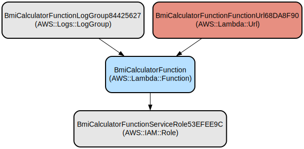

# Serverless BMI Calculator API - Calculate BMI with a Simple HTTP Request

The BMI Calculator is a serverless application that provides a simple HTTP API for calculating Body Mass Index (BMI) based on height, weight, and gender inputs. Built with AWS Lambda and exposed through a Function URL, it offers instant BMI calculations with categorization results.

The application uses the Hono web framework to handle HTTP requests and is deployed using AWS CDK (Cloud Development Kit). It provides two endpoints: a health check endpoint and a BMI calculation endpoint that returns the calculated BMI along with the corresponding category (Underweight, Normal, Overweight, or Obese).

## Repository Structure
```
.
├── bin/                      # Application entry point and CDK app definition
│   └── app.ts               # Main CDK application entry point
├── lib/                     # Core infrastructure code
│   └── bmi-calculator-stack.ts  # AWS infrastructure stack definition
├── src/                     # Application source code
│   ├── index.ts            # Lambda function implementation with Hono routes
│   └── index.test.ts       # Test suite for the BMI calculator
├── cdk.json                # CDK configuration file
├── package.json            # Project dependencies and scripts
└── tsconfig.json          # TypeScript configuration
```

## Usage Instructions
### Prerequisites
- Node.js 18.x or later
- AWS CLI configured with appropriate credentials
- AWS CDK CLI installed (`npm install -g aws-cdk`)
- TypeScript knowledge for development

### Installation

1. Clone the repository and install dependencies:
```bash
git clone <repository-url>
cd bmi-calculator
npm install
```

2. Build the project:
```bash
npm run build
```

3. Deploy to AWS:
```bash
npm run deploy
```

### Quick Start
Once deployed, you can use the BMI calculator API through the provided Function URL. Here's how to use it:

1. Health Check:
```bash
curl https://<function-url>/healthcheck
```

2. Calculate BMI:
```bash
curl "https://<function-url>/bmi-calculator?height=1.75&weight=70&gender=male"
```

### More Detailed Examples

1. Calculate BMI for different scenarios:
```bash
# Example for underweight person
curl "https://<function-url>/bmi-calculator?height=1.80&weight=55&gender=female"

# Example for normal weight
curl "https://<function-url>/bmi-calculator?height=1.75&weight=70&gender=male"

# Example for overweight
curl "https://<function-url>/bmi-calculator?height=1.70&weight=85&gender=male"
```

Example Response:
```json
{
  "gender": "male",
  "height": 1.75,
  "weight": 70,
  "bmi": 22.86,
  "category": "Normal"
}
```

### Troubleshooting

1. Missing Parameters Error:
- Problem: Receiving a 400 Bad Request response
- Solution: Ensure all required parameters (height, weight, gender) are provided in the query string
```bash
# Correct format
curl "https://<function-url>/bmi-calculator?height=1.75&weight=70&gender=male"
```

2. Lambda Function Timeout:
- Problem: Request times out
- Solution: Check CloudWatch Logs at `/aws/lambda/BmiCalculatorFunction`
- Default timeout is set to 30 seconds

3. CORS Issues:
- Problem: Unable to access API from web browser
- Solution: CORS is enabled for all origins by default
- Verify the request method is GET

## Data Flow
The BMI calculator processes requests through a simple request-response flow, transforming input parameters into BMI calculations and categorized results.

```ascii
Client Request -> Function URL -> Lambda Function -> BMI Calculation -> JSON Response
     |                |               |                    |               |
     +----------------+---------------+--------------------+---------------+
     |        Authentication: None    |    Process BMI     |   Return BMI |
     |        Method: GET            |    Calculate       |   & Category |
     +--------------------------------+------------------+---------------+
```

Key component interactions:
1. Client sends GET request with query parameters
2. Function URL forwards request to Lambda
3. Lambda function validates input parameters
4. BMI calculation is performed using weight/(height^2)
5. Category is determined based on BMI value
6. JSON response is returned with results

## Infrastructure


The application is deployed using AWS CDK with the following resources:

Lambda:
- BmiCalculatorFunction (NodeJS 18.x runtime)
  - 30 second timeout
  - Basic execution role
  - Function URL endpoint

IAM:
- BmiCalculatorFunctionServiceRole
  - AWSLambdaBasicExecutionRole policy

Logging:
- CloudWatch Log Group
  - 731 days retention
  - /aws/lambda/BmiCalculatorFunction

Function URL:
- Public endpoint with no authentication
- CORS enabled for GET requests
- All origins allowed